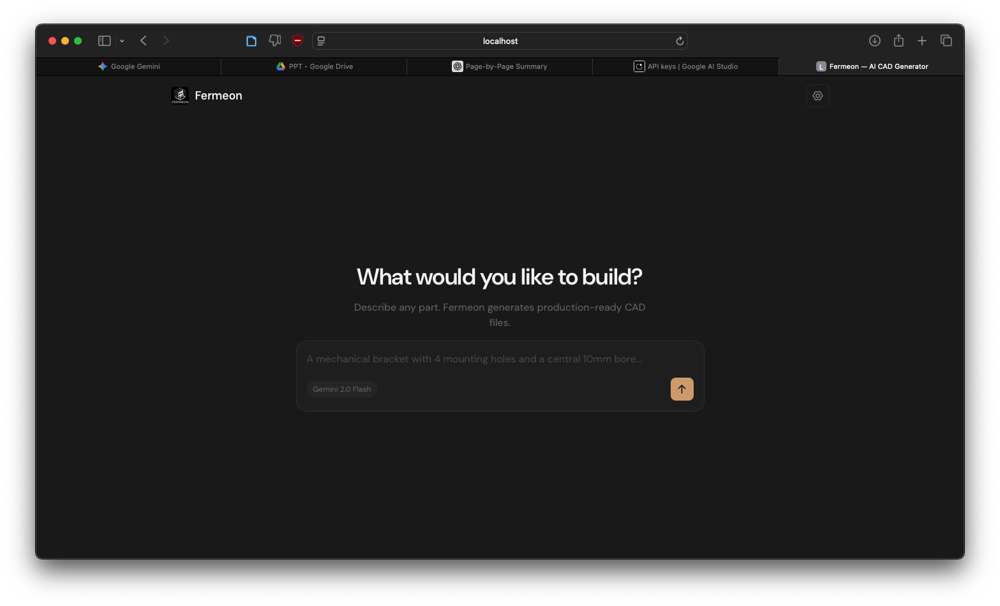

# Fermeon — AI Multi-LLM CAD Generator

Fermeon converts natural language into production-ready CAD files (STEP + STL) using a multi-LLM pipeline built on CadQuery and FastAPI. Describe any part in plain English; Fermeon writes, validates, and self-corrects the parametric Python code until valid geometry is produced.

---

## Features

- **3-Stage LLM Pipeline** — Prompt Enhancement (spec JSON generation) → Structured Spec-to-Code (Trip 2) → Up to 5 self-correction loops with targeted error→hint injection.
- **Domain-Aware Structured Spec** — The enhancer LLM outputs a machine-readable JSON geometry spec (components, exact mm dimensions, assembly order) before code is generated. The code-gen LLM receives this spec directly — far less room to hallucinate dimensions.
- **Ultra-Strict Output Enforcement** — Every prompt includes a non-negotiable output rule at the bottom. No explanatory text can escape the code block.
- **Smarter Self-Correction Engine (up to 5 attempts)** — On failure, the LLM receives: the broken code, the exact error, a targeted hint mapped from the error type (e.g. `BRep_API` → "remove all fillets"), domain bounding-box expectations, and the original spec.
- **Geometric Sanity / Bounding-Box Check** — After successful CadQuery execution, the STEP file is re-imported and the bounding box is checked against domain-specific expected size ranges. Catches unit confusion errors (0.001mm sofa, 5km bracket).
- **Multi-LLM with automatic fallback** — Try cloud models (`gemini-2.0-flash`, `claude-3.5-sonnet`, `o3-mini`) or local models (`qwen2.5-coder:14b`). If one fails, it cascades through your preferred chain.
- **Glassmorphism / Minimalist Web UI** — Vanilla HTML/CSS/JS interface running off FastAPI. Includes Three.js STL previewer and secure API-key caching in browser `localStorage`.
- **Domain-Aware Examples** — System loads different few-shot examples for furniture vs heat exchangers vs architecture. Now includes 1 highly-targeted example per request to save tokens for the richer spec.

## 🎨 The Interface




---

## Quick Start

You'll need **Python 3.8+**.

#### Mac / Linux

```bash
./start.sh
```

#### Windows

```cmd
start.bat
# Or using PowerShell
./start.ps1
```

The launchers automatically install standard pip dependencies, start the backend on port `8000`, and open the modern CAD interface in your default browser.

---

## API Key Integration

Fermeon works with **any cloud LLM** you have an API key for. Keys can be supplied in two ways:

1. **Settings drawer** (gear icon, top-right of UI) — Enter your key for the selected provider. Keys are stored in browser `localStorage` and never sent to Fermeon's own servers. They are passed directly to the LLM provider's API for that request only.
2. **Environment variables** in `backend/.env` — See the [Environment Variables](#environment-variables) section below.

> **Which key do I need?** Select a model from the dropdown, then enter the API key for that provider. Gemini models → `GEMINI_API_KEY`. Claude models → `ANTHROPIC_API_KEY`. GPT/o3 → `OPENAI_API_KEY`. Groq → `GROQ_API_KEY`. Mistral → `MISTRAL_API_KEY`. Local (Ollama) models → no key required.

---

## Supported Models

### Local (Ollama — free, runs on your GPU/CPU)

| Model                          | Display Name        | Context | Best For                         |
| ------------------------------ | ------------------- | ------- | -------------------------------- |
| `ollama/codellama:7b`        | CodeLlama 7B        | 16k     | Simple parts, learning           |
| `ollama/codellama:13b`       | CodeLlama 13B       | 16k     | Medium complexity                |
| `ollama/deepseek-coder:6.7b` | DeepSeek Coder 6.7B | 16k     | Fast iteration                   |
| `ollama/qwen2.5-coder:14b`   | Qwen 2.5 Coder 14B  | 32k     | Complex parts, best local option |
| `ollama/deepseek-r1:14b`     | DeepSeek R1 14B     | 16k     | Reasoning-heavy geometry         |

Pull a model: `ollama pull qwen2.5-coder:14b`

Local models are given **escalating timeouts** across the three internal LiteLLM attempts:

| LiteLLM attempt | Timeout |
| --------------- | ------- |
| 1               | 250 s   |
| 2               | 350 s   |
| 3               | 450 s   |

If attempt 1 finishes in 40 s, the result is used immediately — the larger budgets only apply if the prior attempt actually timed out. Generation progress (token count + elapsed time) is streamed to the server terminal in real time.

### Cloud API

| Model                               | Provider  | Cost/1k tokens | Best For                     | Env Key               |
| ----------------------------------- | --------- | -------------- | ---------------------------- | --------------------- |
| `gemini/gemini-2.0-flash`         | Google    | $0.000075      | Fast, cheap, large context   | `GEMINI_API_KEY`    |
| `gemini/gemini-2.0-pro-exp-02-05` | Google    | $0.00125       | Complex assemblies           | `GEMINI_API_KEY`    |
| `claude-3-5-sonnet-20241022`      | Anthropic | $0.003         | Engineering accuracy         | `ANTHROPIC_API_KEY` |
| `claude-3-7-sonnet-20250219`      | Anthropic | $0.003         | Complex iteration, reasoning | `ANTHROPIC_API_KEY` |
| `gpt-4o`                          | OpenAI    | $0.005         | General purpose              | `OPENAI_API_KEY`    |
| `o3-mini`                         | OpenAI    | $0.0011        | Fast reasoning               | `OPENAI_API_KEY`    |
| `groq/llama-3.1-70b-versatile`    | Groq      | $0.00059       | Fast open-weights            | `GROQ_API_KEY`      |
| `mistral/codestral-latest`        | Mistral   | $0.001         | Code specialist              | `MISTRAL_API_KEY`   |

Set environment variables or enter keys in the Settings drawer. The **default fallback chain** is: `gemini-2.0-flash → llama-3.1-70b (Groq) → qwen2.5-coder:14b (local)`.

> **Fallback bail-out rule:** If a model produces code that fails static validation (wrong API usage), Fermeon exits the fallback chain immediately and enters the self-correction loop with that model rather than trying a fresh model from scratch. A targeted correction is more effective than```
> USER PROMPT
> │
> ▼
> [Pre-loop — runs once, no LLM]
> extract_intent()              local keyword scan → domain + part_type
> build_system_prompt()         loads domain txt + 1 focused few-shot example
> domain_enrich_prompt()        injects domain vocabulary into prompt text
> │
> ▼ LLM TRIP 1  (optional — enhance_prompt toggle)
> gateway.enhance_prompt()      "a sofa" → full geometric spec + SPEC_JSON block
> │                          SPEC_JSON: machine-readable component list with
> │                          exact mm dimensions, z_bottom, assembly_order
> │                          also extracts detected_domain from enhancer output
> ▼
> ┌──────────────────────────────────────────────────────────────────────────────┐
> │  RETRY LOOP  (up to 5 attempts)                                              │
> │                                                                              │
> │  ▼ LLM TRIP 2 (attempt 1)                                                    │
> │  If spec_json available → generate_from_spec()    structured spec → code     │
> │  Otherwise              → generate_cad_code()     enhanced prompt + example  │
> │                                                                              │
> │  ▼ LLM TRIPS 3-N (attempts 2+) — self_correct()                              │
> │    failed_code + exact error + targeted_hint + original_spec → LLM           │
> │    Targeted hint is mapped from error type (BRep_API, rotateAboutX, etc.)    │
> │    Domain bounding-box expectation injected ("chair: 100-4000mm range")      │
> │                                                                              │
> │  ▼ STRIP  (not a LLM call — response_parser.py)                              │
> │  extract_code_from_response()      strips fences, prose, show()              │
> │  _auto_fix_cq_imports()            removes forbidden imports, fixes style    │
> │  _auto_alias_result()              adds result = … if missing                │
> │                                                                              │
> │  ▼ PYTHON CHECK  (not a LLM call)                                            │
> │  ast.parse()                       syntax check (exact line + message)       │
> │  _validate_code_safety()           static checks:                            │
> │    • .union(*list) star-splat  • rotateAboutX/Y/Z  • reversed cylinder args  │
> │    • bare unassigned geometry  • forbidden imports (numpy, pyvista…)          │
> │    • empty .union()/.cut()     • .fillet() before .union()                   │
> │    • sum(parts, …) pattern                                                   │
> │                                                                              │
> │  ▼ CADQUERY EXECUTE                                                          │
> │  execute_cadquery_safe()               sandboxed subprocess + STEP + STL     │
> │                                                                              │
> │  ▼ BOUNDING-BOX SANITY CHECK  (not a LLM call)                               │
> │  _check_bounding_box()                 re-imports STEP, checks largest dim   │
> │    furniture: 100-4000mm  aircraft: 30-60000mm  mechanical: 2-2000mm …       │
> │    out of range → treated as failure → self_correct() with scale hint        │
> │                                                                              │
> │  on success → BREAK ✓                                                        │
> └──────────────────────────────────────────────────────────────────────────────┘
> │
> ├── All attempts failed → HTTP 422 "Could not generate valid geometry"
> │
> ▼
> validate_mesh()               watertightness check on STL
> build file URLs               /files/<job_id>.step  +  .stl
> write_session_log()           JSON to backend/logs/<job_id>.json
> → GenerateResponse

  → GenerateResponse
```

### Key directories

```
backend/
  config/models.py          — model registry (add a model here, nothing else needed)
  routers/generate.py       — main pipeline endpoint (5-step loop)
  services/
    ai_service.py           — intent extraction, example loading, system prompt builder
    cad_executor.py         — sandboxed subprocess executor
    domain_enricher.py      — 942-domain search and context injection
    session_logger.py       — per-request JSON logs (code, tokens, cost, retries)
    llm/
      gateway.py            — LiteLLM wrapper, streaming, fallback chain, retries
      response_parser.py    — code extraction, import repair, syntax validation
      prompt_formatter.py   — few-shot example formatting, correction prompt builder
  prompts/
    system_prompt.txt       — code-gen rules (axis conventions, checklist, import rules)
    enhancer_prompt.txt     — spec-writer rules (Z-stacking, dimensions)
    examples/               — per-domain few-shot CadQuery examples
    domain_prompts/         — domain-specific system prompt fragments
    model_overrides/        — per-model addenda (Ollama, Gemini, GPT, reasoning models)
  cad_domains.json          — 942 engineering domains (generated, do not edit by hand)
frontend/
  index.html / app.js / styles.css   — single-page app, no build step
```

---

## Generation Pipeline Detail

### Trip 1 — Prompt Enhancement

The enhancer LLM rewrites a short prompt into a full geometric specification with explicit Z-stack, per-component footprints, `box(X=…, Y=…, Z=…)` labels, and Z_bottom/Z_top for every part. This prevents the most common failure modes: wrong axis assignment and floating disconnected geometry. Togglable per request; always recommended.

The enhancer also returns a `detected_domain` field. This is used to switch the system prompt and examples to a more specific domain (e.g. `furniture` instead of `mechanical`). A safety guard prevents a model's generic `"mechanical"` fallback from downgrading a domain that was already correctly identified by local intent extraction — for example, `qwen2.5:7b` misclassifying "a sofa" as mechanical.

### Trips 2-N — Code Generation + Self-Correction

Attempt 0 calls `generate_cad_code()` with the enhanced prompt, domain system prompt, and few-shot examples. Attempts 1+ call `self_correct()` which sends:

- The **broken code** from the previous attempt (not empty — preserved even on strip failure)
- The **exact error message** from whichever step failed (strip, syntax, or CadQuery)

The system prompt enforces:

- `import cadquery as cq` — the only valid import style
- `box(X_length, Y_width, Z_height)` — third argument is always vertical (Z)
- `cylinder(height, radius)` — height first, radius second
- `centered=(True, True, False)` for all floor-resting geometry
- `.translate((0, 0, z))` for exact Z-stacking
- Assembly Connectivity Law — every part's Z_min equals the part below's Z_max exactly
- Domain Coherence Law — only domain-appropriate part names (no medical device names on furniture)
- No `.fillet()` on complex union geometry (BRep_API crash risk)
- No invalid methods (`rotateAboutX`, `.copy()`, `.show()`, etc.)

### Strip — Automatic Code Repair (`response_parser.py`)

Applied silently before the syntax check:

| Issue                                             | Fix                                                      |
| ------------------------------------------------- | -------------------------------------------------------- |
| `from cadquery import Workplane, Box, …`       | Removed;`import cadquery as cq` inserted at top        |
| Bare `Workplane(` / `Assembly(` / `Vector(` | Prefixed with `cq.`                                    |
| `cq.WorkPlane(` (wrong capitalisation)          | Corrected to `cq.Workplane(`                           |
| `.show()` / `show_object()` / `display()`   | Stripped (Jupyter-only calls)                            |
| `cq.exporters.export(result, "…")`             | Stripped (executor handles exports)                      |
| No `result = …` assignment                     | `result = <last_workplane_var>` appended automatically |

### Python Check — `ast.parse` + `_validate_code_safety()`

Runs after the strip, before the CadQuery executor. Two phases:

**1. Syntax check** — `ast.parse` finds the exact line and message of any `SyntaxError`. That becomes the correction prompt so the LLM knows the line number, not just "the code is broken".

**2. Static safety validation** — `_validate_code_safety()` raises `ValueError` on patterns that always crash or produce wrong geometry:

| Pattern caught                                                                      | Error message fed to next attempt                                                        |
| ----------------------------------------------------------------------------------- | ---------------------------------------------------------------------------------------- |
| `box(height_var, …)`                                                             | Height variable as X (first) arg — must be third                                        |
| `cylinder(dia_var, …)` or `cylinder(radius_var, …)`                           | Diameter/radius as first arg — HEIGHT must be first                                     |
| `.union(*list_var)` / `.cut(*list_var)`                                         | Star-splat unpacking — second item maps to `clean=` param, silently corrupts geometry |
| Medical terms (`spinal_fusion_cage`, `implant`, `vertebra`) in furniture code | Domain confusion — use furniture part names only                                        |
| `lambda x: cq.Workplane(…)` factories                                            | Lambdas return discarded objects; nothing is unioned                                     |
| `.rotateAboutX/Y/Z()`                                                             | Non-existent CadQuery methods                                                            |
| `.union()` / `.cut()` with no argument                                          | Empty boolean operation                                                                  |
| `.fillet()` after `.union()`                                                    | High BRep_API crash risk                                                                 |
| `sum(parts, cq.Workplane())`                                                      | Invalid list-union pattern                                                               |

Every `ValueError` from this step becomes the `last_error` fed into `self_correct()` for the next attempt — the model receives the exact rule it violated with correct/incorrect examples.

---

## Session Logs

Every request writes a JSON file to `backend/logs/<job_id>.json` containing:

```json
{
  "job_id": "41f75f5c-dd3",
  "prompt": "a sofa",
  "enhanced_prompt": "...",
  "model_used": "ollama/qwen2.5:7b",
  "detected_domain": "furniture",
  "generated_code": "import cadquery as cq\n...",
  "attempts": 2,
  "success": true,
  "time_taken_s": 42.1,
  "cost_usd": 0.0,
  "retry_history": [ ... ],
  "gen_usage": { "prompt_tokens": 1100, "completion_tokens": 1544 }
}
```

Logs include the final generated code even on failure, so you can inspect exactly what the model produced and why it was rejected.

---

## Domain Knowledge Base

`backend/cad_domains.json` contains **942 engineering domains** across 30+ categories (Aerospace, Automotive, Marine, Civil, Architecture, Industrial, Robotics, Electronics, Consumer, Medical, Oil & Gas, Mining, Agriculture, Defence, Rail, Furniture, Sports, Jewellery, Musical, Toys, Fashion, Packaging, Food, Plumbing, Scientific, Textile, Printing, Construction, Space Systems / Emerging).

When a prompt is submitted, a 3-phase scored search finds the top matching domains and injects a focused vocabulary fragment into the system prompt for that request. Re-generate the domain list:

```bash
# Set your OpenAI key, then:
python generate_domains.py
```

---

## Environment Variables

Create a `.env` file in `backend/` or set these in your shell:

```env
GEMINI_API_KEY=...
OPENAI_API_KEY=...
ANTHROPIC_API_KEY=...
GROQ_API_KEY=...
MISTRAL_API_KEY=...
OLLAMA_BASE_URL=http://localhost:11434   # optional, default shown
```

API keys can also be entered per-request in the Settings panel — they are used only for that request and stored in browser localStorage.

---

## Tech Stack

| Layer       | Technology                               |
| ----------- | ---------------------------------------- |
| Frontend    | Vanilla HTML / CSS / JS — no build step |
| 3D Preview  | Three.js (STLLoader + OrbitControls)     |
| Backend     | FastAPI + Uvicorn                        |
| CAD Engine  | CadQuery (OCCT kernel)                   |
| LLM Routing | LiteLLM                                  |
| Local AI    | Ollama                                   |

---

## License

Copyright © 2026 Nilesh Sarkar.
